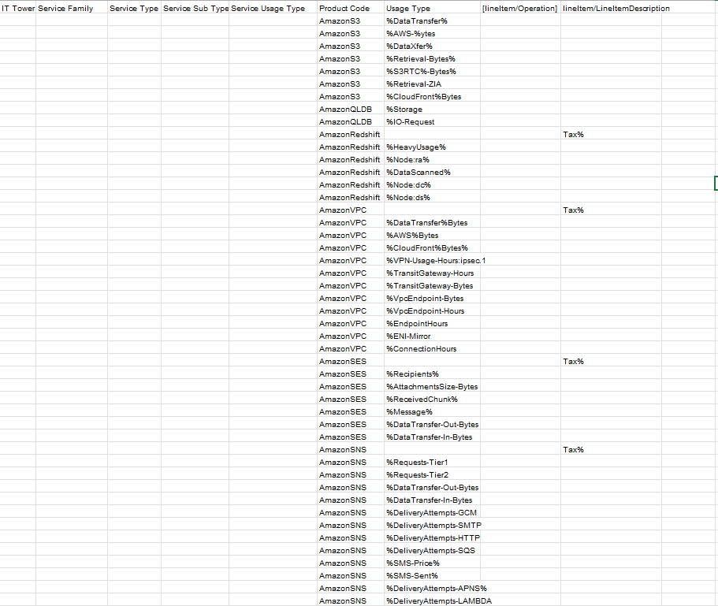

# Аналитическая лабораторная работа №1
### Цель работы:

Знакомство с облачными сервисами. Понимание уровней абстракции над инфраструктурой в облаке. Формирование понимания типов потребления сервисов в сервисной-модели. Сопоставление сервисов между разными провайдерами. Оценка возможностей миграции на отечественные сервисы.
### Ход работы:
1) Исходная таблица, содержащая данные биллинга от провайдера, которую необходимо заполнить данными с документации Amazon

   

2) Классификация сервисов по типам и подтипам

|Тип|Описание|
| :- | :- |
|IT Tower|Группа, ответственная за управление инфраструктурой сервиса, его поддержку и характеристику. Примеры IT Tower: Storage, Machine Learning, Database, Security, Analytics, Compute.|
|Service Family|Группа сервисов, которая выполняет конкретную инфраструктурную задачу и связана с конкретным приложением. Примеры Service Family: Application services, Management or provisioning, GPU-powered acceleration, In-memory caching service, Threat detection service.|
|Service Type|Тип сервиса внутри определенной группы сервисов. Примеры Service Type: Elastic File System, Elastic Inference, ElastiCache, GuardDuty, Kinesis.|
|Service Sub Type|Подтип сервиса с определенной функцией. Примеры Service Sub Type: Fees, Acceleration, Cache Nodes, Security & Compliance и другие.|
|Service Usage Type|Тип использования сервиса с учетом подтипа, также тип запросов, которые может выполнять пользователь с использованием конкретного сервиса. Примеры Service Usage Type: Standard Timed storage, Infrequent Access storage, Tax.|

3) Сервисы Amazon AWS и их аналоги

**1) Amazon Simple Storage Service (Amazon S3)** -  это сервис хранения объектов, предлагающий лучшие в отрасли показатели производительности, масштабируемости, доступности и безопасности данных. Клиенты любой величины и из любой промышленной отрасли могут хранить и защищать необходимый объем данных для практически любого примера использования. Например, для озер данных, облачных приложений и мобильных приложений. 

   **Подтипы:** 

1. **Amazon S3 Standard**

   Класс S3 Standard предлагает высокую надежность, доступность и производительность объектного хранилища для хранения часто используемых данных, обеспечивая низкую задержку и высокую пропускную способность.

2. **Amazon S3 Intelligent-Tiering**

   Является первым облачным хранилищем, автоматически снижающим стоимость хранения на уровне конкретных объектов путем автоматического перемещения данных на наиболее экономичные уровни доступа.

3. **Amazon S3 Express One Zone**

   Высокопроизводительный класс хранилищ с одной зоной доступности, специально разработанный для обеспечения стабильного доступа с быстродействием в несколько миллисекунд к регулярно используемым данным и приложениям.

4. **Amazon S3 Glacier Instant Retrieval**

   Представляет собой класс архивного хранилища, которое отличается минимальной стоимостью длительного хранения данных, доступ к которым требуется редко и которые необходимо извлекать за несколько миллисекунд. 

5. **Amazon S3 Glacier Flexible Retrieval (ранее – S3 Glacier)**

   Предоставляет экономичное хранилище, снижая затраты на 10 % (по сравнению с S3 Glacier Instant Retrieval) для архивных данных, которые нужно получать один или два раза в год в асинхронном режиме.

**Российский аналог:** Yandex Object Storage - это универсальное масштабируемое решение для хранения данных. Оно подходит как для высоконагруженных сервисов, которым требуется надежный и быстрый доступ к данным, так и для проектов с невысокими требованиями к инфраструктуре хранения.

**2) Amazon QLDB (Quantum Ledger Database)** -  это полностью управляемая база данных реестров, обеспечивающая прозрачный, неизменяемый и проверяемый криптографическими методами журнал транзакций.

**Российский аналог:** Не найден

**3) Amazon Redshift** - использует SQL для анализа структурированных и частично структурированных данных в хранилищах данных, операционных базах данных и озерах данных с помощью оборудования, спроектированного AWS, и машинного обучения, чтобы обеспечить максимальную окупаемость при любом масштабе.

Amazon Redshift содержит различные типы узлов, которые можно подобрать в соответствии с рабочими нагрузками.

Основные типы узлов:

1. **RA3** -  позволяют получить оптимальное хранилище данных. Менять масштаб вычислительных ресурсов и управляемого хранилища можно независимо друг от друга.
1. **DC2** - позволяют создать хранилища данных, в которых используются локальные SSD, входящие в комплект поставки, с интенсивным потреблением вычислительных ресурсов. Количество узлов зависит от объема данных и требований к производительности.

**Российский аналог:** Yandex Query - интерактивный, полностью управляемый сервис для инженеров данных и аналитиков. Сервис позволяет выполнять аналитические и потоковые запросы реального времени к структурированным или частично структурированным данным с помощью единого диалекта SQL.

**4) Amazon VPC (Virtual Private Cloud)** - это сервис, который дает возможность запускать ресурсы AWS в определяемой пользователем логически изолированной виртуальной сети. Это позволяет полностью контролировать среду виртуальной сети, в том числе выбирать собственный диапазон IP‑адресов, создавать подсети, а также настраивать таблицы маршрутизации и сетевые шлюзы.

4 основных варианта:

1. ***A*mazon VPC with a single public subnet only** - Облако Amazon VPC, состоящее из одной публичной подсети.
1. **Amazon VPC with public and private subnets** - Облако Amazon VPC, включающее публичные и частные подсети. 
1. **Amazon VPC with public and private subnets and AWS Site‑to‑Site VPN acces**s - Облако Amazon VPC с частными и публичными подсетями и подключением AWS VPN по схеме site‑to‑site.
1. **Amazon VPC with a private subnet only and AWS Site‑to‑Site VPN access** - Облако Amazon VPC с частной подсетью и подключением AWS VPN по схеме site‑to‑site.

**Российский аналог:** Yandex Virtual Private Cloud - это сервис для создания облачных сетей, которые используются для передачи информации внутри облака и соединения облачных ресурсов с интернетом.

**5) Amazon SES (Simple Email Service) -**  это облачный поставщик сервисов электронной почты, который может быть интегрирован в любое приложение для автоматизации больших объемов электронной почты.  Amazon SES – это инструмент отправки электронной почты, который поддерживает различные варианты развертывания, включая выделенные, общие или собственные IP-адреса. 

**Российский аналог:**  Yandex Cloud Postbox - сервис предназначен для работы с транзакционными письмами — Email-сообщениями, отправленными получателю в ответ на определенные действия, например, напоминания пароля или подтверждения покупок. 

**6)  Amazon SNS (Simple Notification Service) -** это веб‑сервис, упрощающий настройку, использование и отправку уведомлений из облака. Простой сервис уведомлений Amazon SNS использует два метода отправки сообщений: A2A и A2P.

1. **A2A** обеспечивает высокую пропускную способность для обмена push-уведомлениями между распределенными системами, микросервисами и бессерверными приложениями на основе событий по модели «многие ко многим». К таким приложениям относятся Amazon Simple Queue Service (SQS), Amazon Kinesis Data Firehose, AWS Lambda и другие конечные точки HTTPS. 
2. **A2P** позволяет отправлять клиентам текстовые SMS-сообщения, push-уведомления и электронные письма. 

**Российский аналог:** Yandex Message Queue - универсальное масштабируемое решение для обмена сообщениями между приложениями. Сервис очередей для обмена сообщениями между компонентами распределенных приложений и микросервисов.

4) Итоговая таблица

5) Вывод

В ходе выполнения данной лабораторной работы мы ознакомились с облачными сервисами Amazon AWS. А также получилось найти российские аналоги для данных сервисов. 
