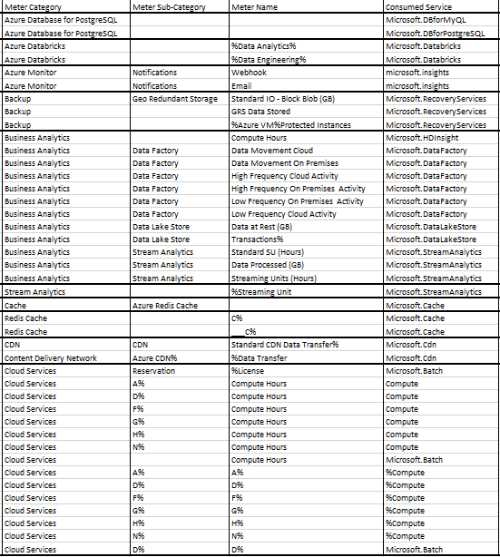
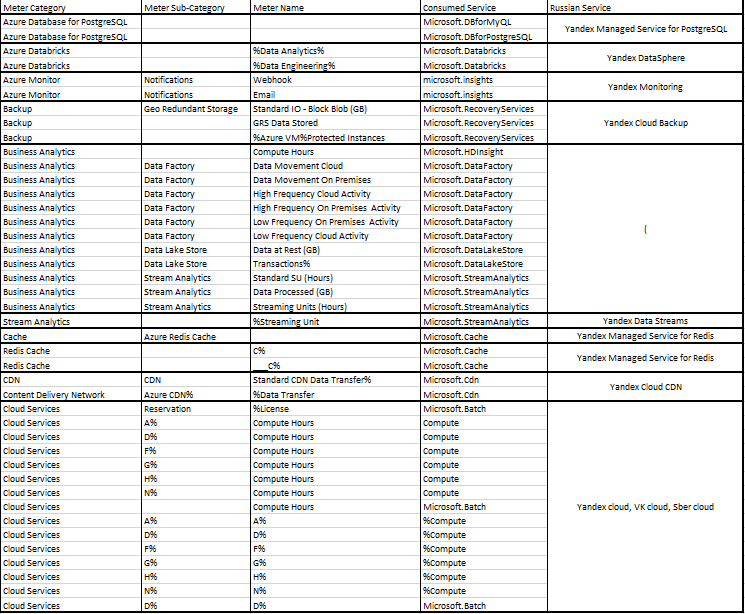

## Аналитическая лабораторная работа №2

### Изначальная таблица

### Встретившиеся сервисы Azure

**1. Azure Database for PostgreSQL** - это служба реляционной базы данных в облаке Майкрософт на основе реляционной базы данных с открытым исходным кодом PostgreSQL.

**Российский аналог: Yandex Managed Service for PostgreSQL** - сервис для развертки и поддержки кластеров серверов PostgreSQL в инфраструктуре Yandex Cloud

**2. Azure Databricks**  — единая, открытая платформа аналитики для создания, развертывания, совместного использования и обслуживания корпоративных данных, аналитики и решений искусственного интеллекта в масштабе.

**Российский аналог: Yandex DataSphere** — это сервис для ML-разработки полного цикла, который позволяет использовать все преимущества облачных технологий

**3. Azure Monitor** - комплексное решение для мониторинга для сбора, анализа и реагирования на данные мониторинга из облачных и локальных сред.

**Российский аналог: Yandex Monitoring**.Сервис позволяет собирать, хранить и отображать метрики, а также настраивать алерты и присылать по ним уведомления.

**4. Azure Backup** — сервис, обеспечивающей резервное копирование одним щелчком, которое масштабируется в зависимости от ваших потребностей в хранилище резервных копий.

**Российский аналог: Yandex Cloud Backup** - Сервис для создания резервных копий и восстановления виртуальных машин.

**5. Azure Business Analytics** - корпоративная служба аналитики, которая ускоряет извлечение аналитических сведений в разных хранилищах данных и системах больших данных.

**Российский аналог: Не найден**

**6.Azure Stream Analytics** — это полностью управляемая подсистема потоковой обработки, предназначенная для анализа и обработки больших объемов потоковых данных

**Российский аналог: Yandex Data Streams** - Yandex Data Streams — масштабируемый сервис для управления потоками данных в режиме реального времени.

**7.Azure Cache/Redis cache** - предоставляет хранилище данных в памяти на основе программного обеспечения Redis.

**Российский аналог: Yandex Managed Service for Redis** - помогает разворачивать и поддерживать кластеры серверов Redis 6.2 и 7.0 в инфраструктуре Yandex Cloud. 

**8. Content Delivery Network (CDN)** - является распределенной сетью серверов, которая позволяет эффективно доставлять пользователям веб-содержимое. Сеть CDN хранит кэшированное содержимое на пограничных серверах в расположениях точки присутствия, расположенных близко к конечным пользователям, чтобы свести к минимуму задержку.

**Российский аналог: Yandex Cloud CDN** - Сервис для организации сети распространения контента

**9. Azure cloud Services** - платформа для создания и масштабирования приложений в облаке

**Российские аналоги: Yandex Cloud, VK Cloud, Sber Cloud, e.t.c.**

### Итоговая таблица

## Вывод

В ходе выполнения данной лабораторной работы мы ознакомились с облачными сервисами Azure. А также получилось найти российские аналоги для данных сервисов. 
